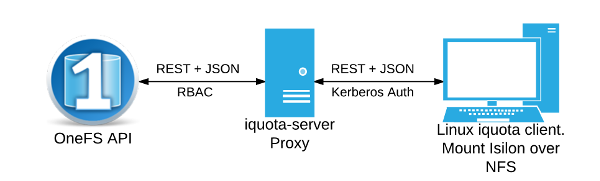

===============================================================================
Linux CLI tool for Isilon OneFS SmartQuota reporting
===============================================================================

------------------------------------------------------------------------
What is iquota?
------------------------------------------------------------------------

iquota is a command line tool and associated server application for reporting
quotas from Isilon nfs mounts using the OneFS API. Isilon is a scale out NAS
platform by EMC and when used in a Linux environment lacks adequate CLI tools
for reporting quotas from client mounts. For example, in an HPC environment
where Isilon is mounted via nfs on a front end machine running Linux, users
need a way to check and report on their quotas. This project aims to provide a
tool very similar to the native quota command in Linux but for Isilon nfs
mounts. This `post <https://community.emc.com/message/762183#762183>`_ sums up
essentially what this project aims to provide.  

The following diagram shows the basic architecture of iquota:

Linux clients mount Isilon /ifs over nfs. Users obtain kerberos credentials via
knit and run the iquota client command which connects to the iquota-server
(proxy) over HTTPS (using GSSAPI/SPNEGO for auth). The iquota-proxy server
validates the users kerberos credentials and requests quota information using
the OneFS API. The iquota-server connects to the OneFS API using a system
account which has read-only access to quota information using OneFS RBAC (role
based access control).

------------------------------------------------------------------------
Features
------------------------------------------------------------------------

- User/Group quota reporting from command line
- Kerberos based authentication
- Caching via redis

------------------------------------------------------------------------
Requirements
------------------------------------------------------------------------

- Isilon OneFS API (v7.2.1)
- Linux
- Kerberos
- sssd-ifp (SSSD InfoPipe responder)

------------------------------------------------------------------------
Install and configure iquota-server proxy
------------------------------------------------------------------------

*Note these docs are for CentOS 7.x. May need adjusting depending on your
flavor of Linux*

Download the RPM release `here <https://github.com/ubccr/iquota/releases>`_::

  $ rpm -Uvh iquota-server-0.x.x-x.el7.centos.x86_64.rpm

Create user account for accessing OneFS API
============================================

Create a role in OneFS that allows read-only access to quota information. For
example::

    # isi auth roles create --name=roQuotaUser --description='Readonly quota access'
    # isi auth roles modify --add-priv-ro=ISI_PRIV_QUOTA --role=roQuotaUser

Create a system user/pass account and add this user to the role. This will be
the user account the iquota-server will use to connect to OneFS API.

Setup Kerberos HTTP keytab
===========================

The iquota-server uses Kerberos authentication. You'll need to create a HTTP
service keytab file. For example::

    kadmin: addprinc -randkey HTTP/host.domain.com@YOUR-REALM.COM

If using FreeIPA you can run::

    $ ipa service-add HTTP/host.domain.com
    $ ipa-getkeytab -s master.domain.com -p HTTP/host.domain.com -k http.keytab

Configure sssd
===============

iquota-server uses sssd-ifp (SSSD InfoPipe responder) over DBUS to fetch the
unix groups for a given user. For more information on sssd-ifp see `here
<https://jhrozek.fedorapeople.org/sssd/1.12.0/man/sssd-ifp.5.html>`_.

Ensure the sssd-dbus package is installed::

    # yum install sssd-dbus

Configure sssd-ifp. Add the following lines to /etc/sssd/sssd.conf::

    [sssd]
    services = nss, sudo, pam, ssh, ifp

    [ifp]
    allowed_uids = iquota, root

Restart sssd to make the changes take effect::

    # systemctl restart sssd

You can test to ensure sssd-ifp is configured properly by running the following
command. The array of unix groups for the user should be displayed::

    # dbus-send --print-reply --system \
      --dest=org.freedesktop.sssd.infopipe \
      /org/freedesktop/sssd/infopipe \
      org.freedesktop.sssd.infopipe.GetUserGroups \
      string:username

       array [
          string "physics"
          string "compsci"
          string "users"
       ]

Configure iquota.yaml
=====================

Edit iquota configuration file. Add host, port, user/pass for OneFS API, path to
http keytab::

    $ vim /etc/iquota/iquota.yaml 
    onefs_host: "localhost"
    onefs_port: 8080
    onefs_user: "user"
    onefs_pass: "pass"
    keytab: "/path/to/http.keytab"
    [ edit to taste ]

It's highly recommended to run iquota-server using HTTPS. You'll need an SSL
cert/private_key either using FreeIPA's PKI, self-signed, or from a commercial
certificate authority. Creating SSL certs is outside the scope of this
document. You can also run iquota-server behind haproxy or Apache/Nginx.

Copy your SSL cert/private_key to the following directories and set correct
paths in /etc/iquota/iquota.yaml. The iquota-server binary will run as non-root
user (iquota) so need to ensure file perms are set correctly::

    $ mkdir /etc/iquota/{cert,private}
    $ cp my.crt /etc/iquota/cert/my.crt
    $ cp my.key /etc/iquota/private/my.key
    $ chmod 640 /etc/iquota/private/my.key
    $ chgrp iquota /etc/iquota/private/my.key

Start iquota-server service
============================

Start iquota-server service::

    $ systemctl restart iquota-server
    $ systemctl enable iquota-server

To view iquota-server system logs run::

    $ journalctl -u iquota-server

------------------------------------------------------------------------
Install iquota on all client machines mounting /ifs over nfs
------------------------------------------------------------------------

On all client machines mounting Isilon /ifs over nfs install the iquota client.
Download the RPM release `here <https://github.com/ubccr/iquota/releases>`_::

  $ rpm -Uvh iquota-0.x.x-x.el7.centos.x86_64.rpm

Edit iquota configuration file. Add URL for iquota-server::

    $ vim /etc/iquota/iquota.yaml 
    iquota_url: "http://host.domain.com"
    [ edit to taste ]

------------------------------------------------------------------------
Usage
------------------------------------------------------------------------

Check user/group quotas::

    $ kinit walterwhite
    Password for walterwhite@REALM:
    $ iquota -u -g
    User quotas:
    Filesystem  user               files      used     limit    grace 
    /ifs/user
                (default)                             2.0 GB   1 week 
                walterwhite           34    370 kB    2.0 GB   1 week 

    Group quotas:
    Filesystem  group              files      used     limit    grace 
    /ifs/projects
                (default)                             520 GB   1 week 
                hermanos               4    699 MB    520 GB   1 week

------------------------------------------------------------------------
Configure caching
------------------------------------------------------------------------

iquota-server can optionally be configured to cache results for a given time
period. This helps reduce the load on the OneFS API and provide better iquota
performance. To enable caching first install redis then update
/etc/iquota/iquota.yaml.

Install Redis (install from EPEL)::

    $ yum install https://dl.fedoraproject.org/pub/epel/epel-release-latest-7.noarch.rpm
    $ yum install redis
    $ systemctl restart redis
    $ systecmtl enable redis

Edit /etc/iquota/iquota.yaml and restart::

    $ vi /etc/iquota/iquota.yaml
    enable_caching: true

    $ systecmtl restart iquota-server

------------------------------------------------------------------------
References
------------------------------------------------------------------------

1. OneFS API Docs - https://community.emc.com/docs/DOC-48273

------------------------------------------------------------------------
License
------------------------------------------------------------------------

iquota is released under a BSD style license. See the LICENSE file. 
